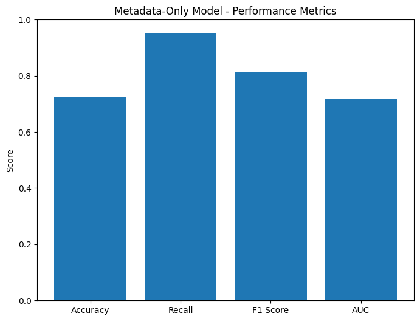
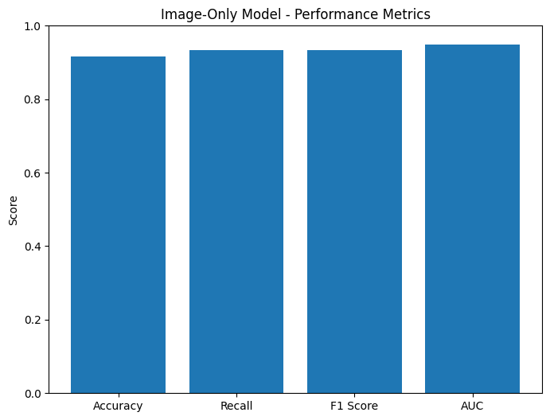
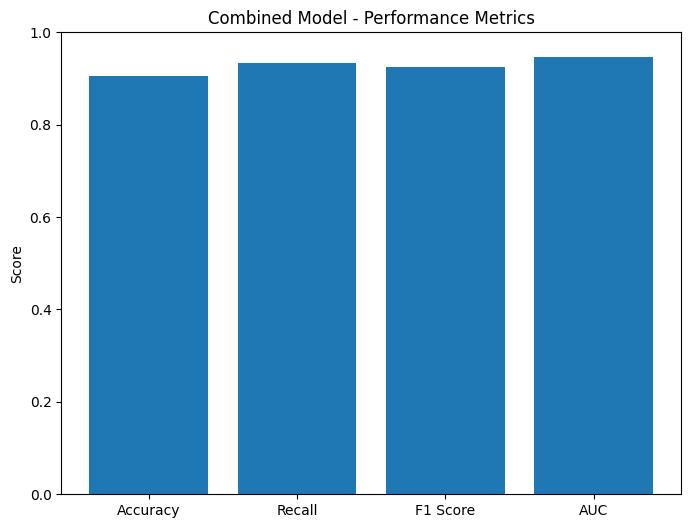
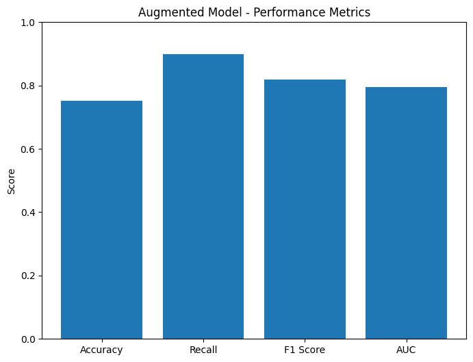
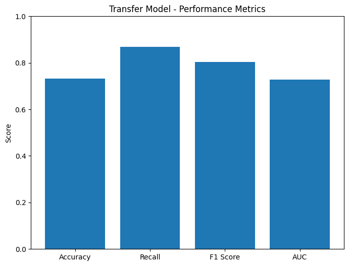
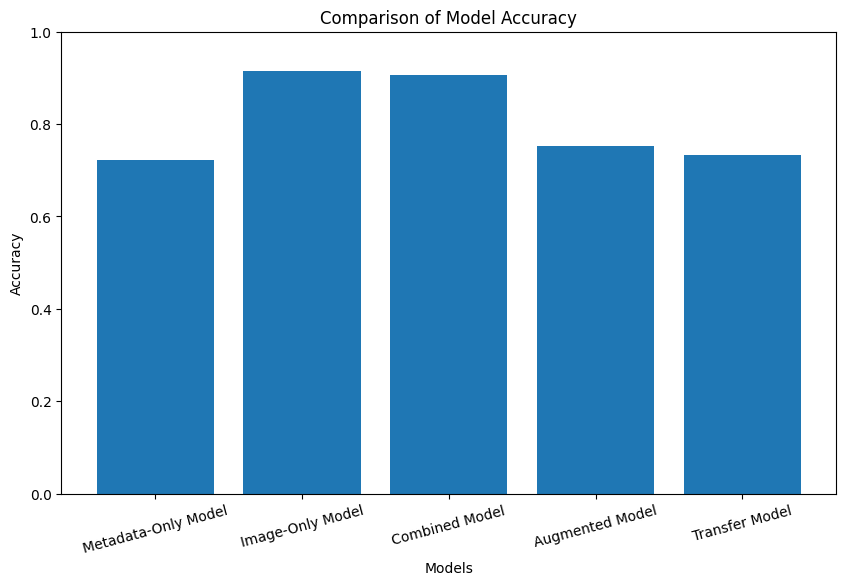
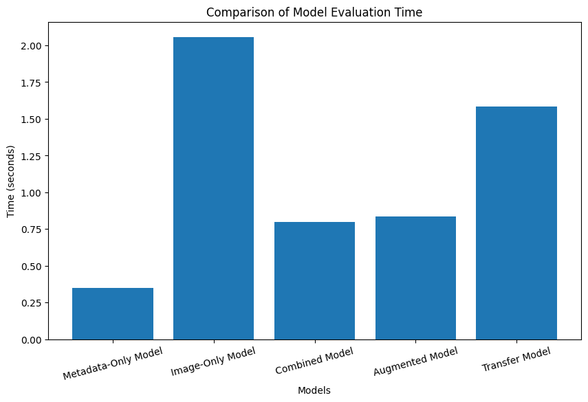

# Deer Identification

Utilizing trail camera data to train a convolutional neural network (CNN) that identifies whether a deer is present in an image, combining contextual metadata for enhanced predictions.

With the conditions of a trail camera, such as poor quality and low light levels, metadata like time, wind, temperature, and moon phase is explored to improve predictions.

---

## Results Overview

### Model Results

The results of the models are as follows (refer to the images below):

1. **Metadata-Only Model**

   - Accuracy: `72.3%`
   - Purpose: Evaluate the impact of metadata without image input.
   - Result: Inconsistent metadata likely limited prediction accuracy.
   - 

2. **Image-Only Model**

   - Accuracy: `91.55%`
   - Purpose: Test performance using only images.
   - Result: Best-performing single-input model.
   - 

3. **Combined Model**

   - Accuracy: `90.61%`
   - Purpose: Use both image and metadata inputs for prediction.
   - Result: Slightly lower accuracy than the image-only model, but significantly faster evaluation time.
   - 

4. **Augmented Model**

   - Accuracy: Lower than baseline models.
   - Purpose: Test dataset augmentation to increase diversity.
   - Result: Did not improve accuracy with this small dataset.
   - 

5. **Transfer Learning Model**
   - Accuracy: Lower than baseline models.
   - Purpose: Test performance with pre-trained models like ResNet or ImageNet.
   - Result: Lower accuracy compared to custom-built models.
   - 

### Accuracy and Evaluation Time Comparisons

- Accuracy of all models:
  

- Evaluation time of all models:
  

---

## File Descriptions

### Main Files

- **`image_collection.py`**  
  Script to gather images for training. Connects to the trail camera cloud service, downloads images, and organizes metadata.

- **`image_processing.py`**  
  Preprocesses images for training, including:

  - Cropping out the bottom metadata border.
  - Resizing images to a standard size (224x224).
  - Cleaning and formatting the metadata.

- **`train.ipynb`**  
  Jupyter Notebook for training the models:
  - Metadata-only.
  - Image-only.
  - Combined model.

### Helper Files

- **`helper/accuracy_test.py`**  
  Evaluates the accuracy of pre-labeled tags.

- **`helper/json_to_csv.py`**  
  Converts metadata from JSON to CSV for use in training.

### Environment and Setup

- **`requirements.txt`**  
  Lists all required Python dependencies for the project.

- **`.env-template`**  
  Template file for environment variables:
  - `API_BEARER`: Authentication token for image collection.
  - `API_URL`: Endpoint for image downloads.
  - `IMAGE_TOTAL`: Optional, set the number of images to process.
  - `TAKE_AMOUNT`: Default is `50`.
  - `IMAGES_JSON`: File path for metadata JSON.
  - `IMAGE_PROCESSED_DIR`: Directory for processed images.

---

## Setup Instructions

1. Clone the repository.
2. Install the required dependencies:

```bash
pip3 install -r requirements.txt
```

3. If using macOS, install tkinter for the labeling tool:

```bash
brew install python-tk
```

4. Configure the .env file based on .env-template.
5. Run scripts in the following order:
- image_collection.py
- image_processing.py
- Use `train.ipynb` for model training.
